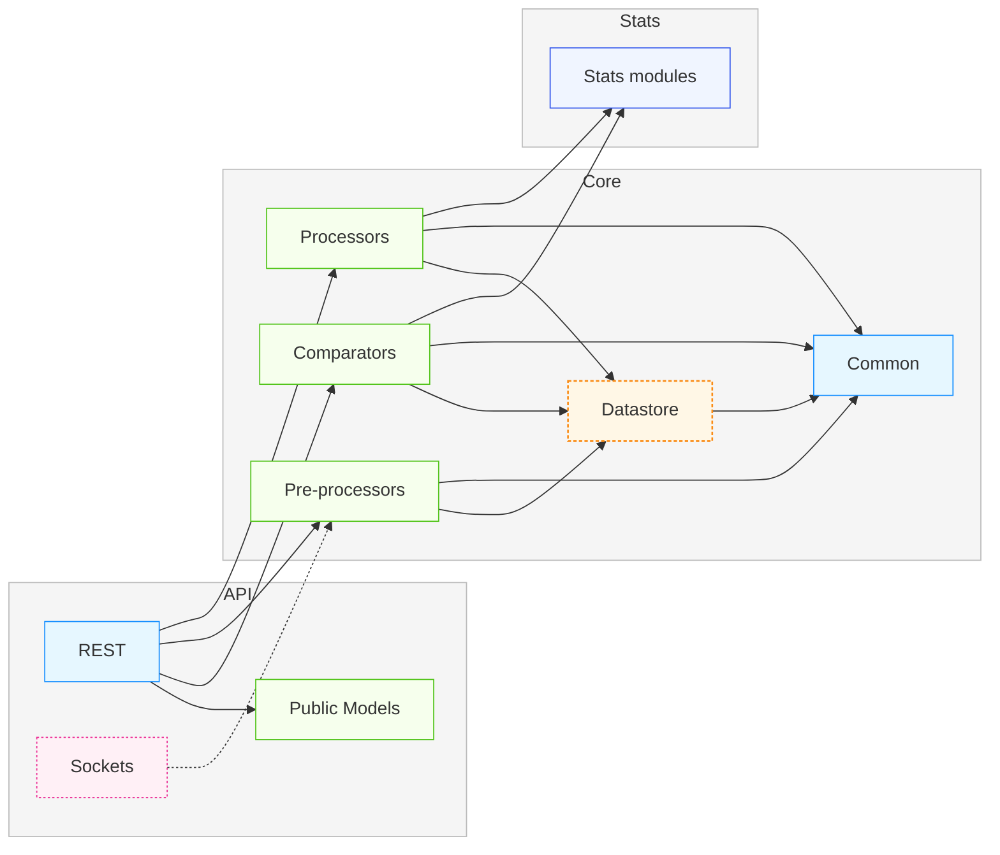

# scratch

## 🧑‍💻 Development Environment

This project uses **[devenv](https://devenv.sh/getting-started/)** for
environment management and **[Just](https://github.com/casey/just)** as a
command runner. Dependencies are managed with
**[uv](https://github.com/astral-sh/uv)**, and code quality tools are handled
via **[pre-commit](https://pre-commit.com/)**.

Using `devenv` ensures a fully reproducible development setup — including Python
version, dependencies, and tooling — across all machines.

### 🚀 Recommended setup (with devenv)

#### pre-requirements

- [devenv](https://devenv.sh/getting-started/)

```bash
devenv shell
```

Or allow your project to start isolated shell at the point of directory entry

```bash
direnv allow
```

This will:

- Enter the `devenv` shell with the correct environment
- Automatically install **UV**
- Sync all project dependencies
- Install and configure **pre-commit** hooks

You can now start developing right away.

### 🧰 Alternative setup (without devenv)

If you prefer not to use `devenv`, you can still set things up manually:

#### UV

It could be that you need to use a private package index proxy, if that is the
case add the following

```toml
# ~/.config/uv/uv.toml
[[index]]
url = "https://<your domain>/<route>/simple"
default = true
```

```bash
# Create and sync a virtual environment
uv venv
uv sync
source ./.venv/bin/activate
```

#### pre-commit

```yaml
# .pre-commit-config.yaml
repos:
  - repo: https://github.com/pre-commit/pre-commit-hooks
    rev: "v6.0.0"
    hooks:
      - id: check-case-conflict
      - id: check-merge-conflict
      - id: check-toml
      - id: check-yaml
      - id: check-json
      - id: pretty-format-json
        args: [--autofix, --no-sort-keys]
      - id: end-of-file-fixer
      - id: trailing-whitespace

  - repo: https://github.com/astral-sh/ruff-pre-commit
    rev: "v0.14.1"
    hooks:
      - id: ruff-check
        args: [--exit-non-zero-on-fix]
      - id: ruff-format
```

```bash
# create and copy pre-commit-config.yaml
pre-commit install
pre-commit install-hooks
just check # will run pre-commit for all files (not required)
```

> [!NOTE] Using `devenv` is highly recommended — it guarantees a consistent,
> isolated, and reproducible development environment.

## Usage

### Start API Server

```bash
just api
```

## Project Structure


