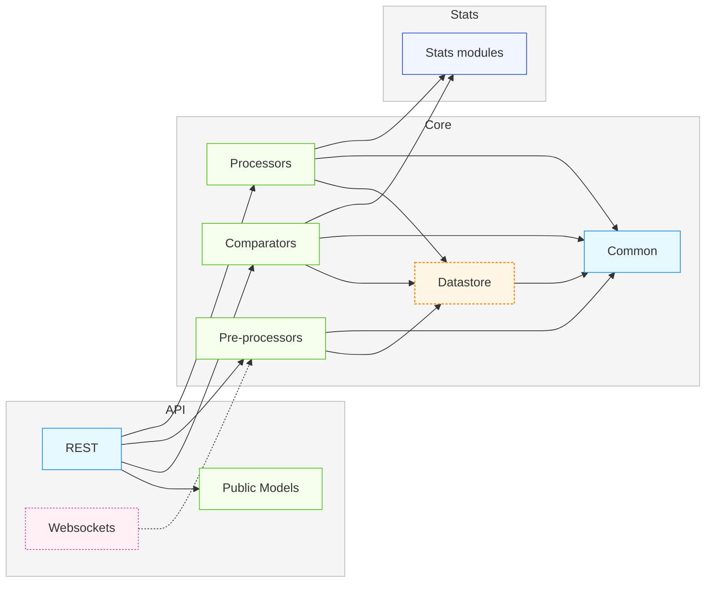

# scratch

## 🧑‍💻 Development Environment

This project **[Just](https://github.com/casey/just)** as a
command runner. Dependencies are managed with
**[uv](https://github.com/astral-sh/uv)**, and code quality tools are handled
via **[pre-commit](https://pre-commit.com/)**.

### 🧰 Setup

Before continuing, make sure to have **[Just](https://github.com/casey/just)** and
**[uv](https://github.com/astral-sh/uv)** installed.

#### UV

It could be that you need to use a private package index proxy, if that is the
case add the following

```toml
# ~/.config/uv/uv.toml
[[index]]
url = "https://<your domain>/<route>/simple"
default = true
```

```bash
# Create and sync a virtual environment
uv venv
uv sync
source ./.venv/bin/activate
```

```bash
# Install pre-commit
pre-commit install
pre-commit install-hooks
just check-quality # will run pre-commit for all files (not required)
```

## Usage

### Start API Server

```bash
just api
```

## Project Structure

This project tree
follows: [fastapi-best-pactices](https://github.com/zhanymkanov/fastapi-best-practices?tab=readme-ov-file#fastapi-best-practices-)

- <span style="color:#f5f5f5">grey</span> are packages
- <span style="color:#e6f7ff">blue</span> are public modules
- <span style="color:#f6ffed">green</span> internal public modules
- <span style="color:#fff7e6">orange</span> is data-store (type of data-store is
  still to be determined)
- <span style="color:#fff0f6">pink</span> is optional (may not be implemented)
- <span style="color:#f0f5ff">purple</span> are external team development


```mermaid
flowchart LR

  %% ===== Styles =====
  classDef pkg fill:#f5f5f5,stroke:#bbb,stroke-width:1px,color:#333;
  classDef public fill:#e6f7ff,stroke:#1890ff,stroke-width:1px;
  classDef internal fill:#f6ffed,stroke:#52c41a,stroke-width:1px;
  classDef datastore fill:#fff7e6,stroke:#fa8c16,stroke-width:1.5px,stroke-dasharray:3 2;
  classDef optional fill:#fff0f6,stroke:#eb2f96,stroke-dasharray:2 2;
  classDef extTeam fill:#f0f5ff,stroke:#2f54eb;

  %% ===== API Workspace =====
  subgraph API[API]
    direction TB
    api_rest[REST]:::public
    api_sockets[Websockets]:::optional
    api_models[Public Models]:::internal
  end
  class API pkg

  %% ===== Core Workspace =====
  subgraph CORE[Core]
    direction TB
    core_pre[Pre-processors]:::internal
    core_proc[Processors]:::internal
    core_comp[Comparators]:::internal
    core_common[Common]:::public
    core_store[Datastore]:::datastore
  end
  class CORE pkg

  %% ===== Stats Workspace =====
  subgraph STATS[Stats]
    direction TB
    stats_pkg[Stats modules]:::extTeam
  end
  class STATS pkg

  %% ===== Dependencies / Policies =====
  %% API talks only to Core (no direct Stats or Datastore access)
  api_rest --> core_proc
  api_rest --> core_pre
  api_rest --> core_comp
  api_rest --> api_models

  %% Optional Sockets (still to be determined)
  api_sockets -.-> core_pre

  %% Core uses Stats
  core_proc --> stats_pkg
  core_comp --> stats_pkg

  %% Core modules depend on Common
  core_pre --> core_common
  core_proc --> core_common
  core_comp --> core_common
  core_store --> core_common

  %% Modules that need storage access → Datastore
  core_pre --> core_store
  core_proc --> core_store
  core_comp --> core_store
```
